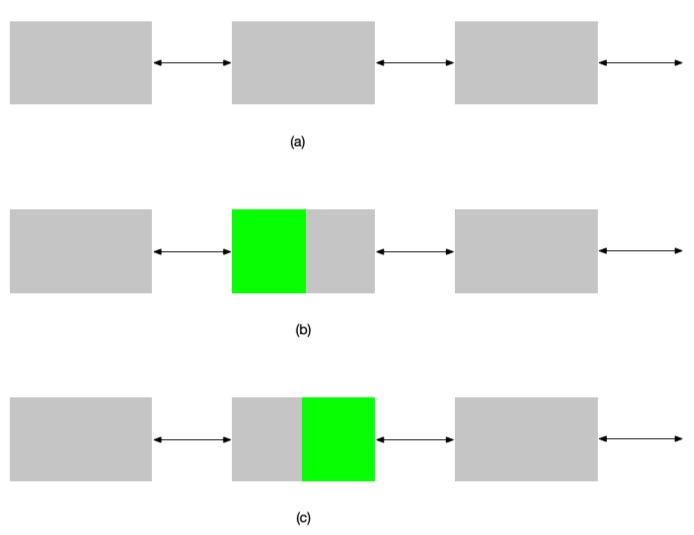

# Report 1: Malloc Library Part 1

- Student Name: Yifan Men
- Student NetID: ym129

## 1. Overview of implementation

For this assignment, I tried a lot of way on implementation and fixed lots of bugs. I will mention some of them, and explain the reasons. There would be multiple versions, but the **1.2 Basic Implementation with Free List** part is the implementation of my submission code. If necessary, graders can visit my [git repository](https://github.com/menyf/ECE650/tree/master/HW01_malloc_impl) and reset to previous commit to check the code, though some are bugy.

### 1.1 Simple Stimulation on Memory Allocation

Very intuitive, we can simply have an implementation of memory allocation. The key of this solution is based on the fact that heap are allocated continuously. 

However, we can call `sbrk()` to allocate requested memory, but when it comes to `free()` implementation, we have no idea how to do this. Therefore, it leads me to the most important part of this implementation--meta information storage. In the very first version, my meta information was defined in the following way:

```C
typedef struct BlockInfo{
    size_t size;
    struct BlockInfo * next;
    struct BlockInfo * prev;
    int isFree;
} block_t;
```

This is very straight forward, we record how much space it takes up, what's the address of the previous allocated and next allocated block, and whether it is free. When we use `sbrk()` to allocate some memory on heap, we can create such block.

One problem for `malloc()` is that what would happen if the block size is greater than requested, but less than requested and another block size. Here, I take the policy that if the size of a block is between `requested_size` and `requested_size + sizeof(block_t)`, then we use this block, for the extra space we give it to callers for free. Please note that this is an important key in my design.

When thinking of coalesce, we can simply check whether the the previous one is free or not. If so, we merge the adjacent two blocks into one. When I was dealing with the coalesce, at beginning, I think it would takes $O(n)$ to find the place that need to merge. Latter, I realized we already have the address of the previous address, the latest freed one can only affect its adjacent two blocks, then we can check its two adjacent blocks and do necessary coalesce operation. 

When I finished the implementation and passed general test, I started running, but it is extremely slow, after several seconds, I gave up on this way, and found the free list way on Piazza.

### 1.2 Basic Implementation with Free List

When I was thinking about free list, it would be a linked list connecting all free blocks. It should be ordered in an ascending way because we need to find the first-fit block. Linked-list node(free block) must not connected adjacently, otherwise it should be coalesced into a new one. In this way, we do not need to record whether a block is free, since every block in free list is free, the rest are not.

```C
typedef struct BlockInfo {
  size_t size;
  struct BlockInfo *next;
  struct BlockInfo *prev;
} block_t;
```

I used `block_t` to denote the Node data structure in free list, and it is a doubly linked list. 

For `malloc()`, we need to search in the linked list according to specific policy(best-fit or first-fit). For the most simple situations would be:

1. no free blocks
2. no free blocks with enough space

We call `sbrk()` for a larger space. Otherwise, if we can find one in the free list, that is big enough, we have two situations. For one, like I mentioned above, the rest part of the block is not big enough to form a new one, we simply give the extra space to users for free. For another, we need to split it. 

The split operation involves lots of pointer operations, which is very complicated. Imagine we want to split the middle block of figure(a) below into two, one is malloced(green), the rest is still free.



I implemented with figure(b) first, and found it complicated to remove the whole block from free list, and add the rest part back. Actually, with figure(c), we can simply resize the block to a smaller one, and initialize the green block with necessary information. It would not apply any changes on the previous block and the following block, which is much more clear.

For the coalesces operation, unlike the previous solution that checks `isFree` flag, we can do pointer arithmetic calculations to check whether the next block in the free list is adjacent to latest added one, so it applies to previous adjacent block.

Another really tricky thing is for best-fit policy. We need to judge whether we found the perfect block, if so, we could simply return it without keep iteration, which will greatly reduce time consumption.

### 1.3 Further Improvements

For this part, I thought of them and tried to implement but finally failed, graders can check git commit log for details if necessary.

When thinking of allocation, the most simple way would be call `sbrk()` once no reusable block available. However, `sbrk()` is a system call, which means it consumes a lot of time. Then I came up with the idea that we can allocate a large block, put the rest part into the free list, then for next allocation, we can find the applicable one at the end of the free list. Further, I thought of amortized analysis, like what applied to vector allocation, we can try to double the allocated space. I believe this is the most efficient way to call `sbrk()`. I tried to implement the way that allocate specific size of block, but finally I was running out of time and gave up on it.

It is intuitive that we create the free list in an address-ascending way for first-fit policy. When it comes to best-fit, we may want the free list to be sorted by block size. It would lead to another question, how can we merge two blocks that hold the adjacent addresses. One way to solve this is to add previous block that connects to it in terms of address(rather than connecting in linked list), we can put the greatest or latest one at the beginning of linked list. 


## 2. Result & Analysis

Here are my results:

| Pattern | First-Fit<Br>Exec Time | First-Fit<Br>Fragmentation | Best-Fit<Br>Exec Time | Best-Fit<Br>Fragmentation |
| --- | --- | --- | --- | --- |
| Equal | 18.9s | 0.45 | 19.2s | 0.45 |
| Small | 17.0s | 0.075 | 5.6s | 0.02 |
| Large | 109.2s | 0.09 | 137.8s | 0.04 |


For `equal_size_allocs`, the size of block is fixed at 128B, so every block in the free list is the same, each time, it takes the front block as in either way. From the memory perspective, these two ways do exactly the same thing, so the time is pretty close. For fragmentation, it is obviously the same since it is calculated halfway, around 0.5.

For `small_range_rand_allocs`, it randomly swap the values in `free_list`, it freed all block with index 0 before calculation. When the clock start record time, it freed all address with data, and then malloc the address with no data before free. In this case, it would be really random, since the size of blocks is uncertain. Theoretically, when it encounter a block whose size is greater than requested, it must become a first-fit, but may not a best-fit. However, according to data, it turns out to be the opposite. I think that it would give a better taking up in best-fit policy. For example, if we have a list with size of `20, 15, 10`, we are requesting `15, 20, 10`. For best-fit, it will takes up these three. For first-fit, it would take up `20` for `15`, resulting in a new `sbrk()` call, which consumes more time than iteration.
 

For `large_range_rand_allocs`, it is doing the same thing as `small_range_rand_allocs`, but the size of blocks varies greatly than `small_range_rand_allocs`. My result turns out to prove the theory I put. For this situation, I believe it will forms a rather long list. Then iteration may take the critical time consumption rather than `sbrk()`.


**Conclusion:** In reality, data size varies greatly from a very small piece to a very large one, which is more like `large_range_rand_allocs` here. I would recommend first-fit policy rather than best-fit policy, if we need to go through a long list, it would cost too much time, and the chance to find a perfect block is barely possible. Also, if we know the data range is pretty small, I would recommend best-fit policy.


## 3. Other Lessons

### 3.1 Optimization
In the `Makefile`, it used `-O3` flag, which makes debugging really difficult. However, it is a way to optimize.

### 3.2 Abstraction
For the two policies, I thought the difference between the two. I think the only different is how to search for fit block. I declared a function pointer whose return value is a `block_t *`, indicating the block to be malloced. And for free part, there is no difference between these two policies in my design. I think this is a good instance for abstraction in C, greatly reduced redolent code.
